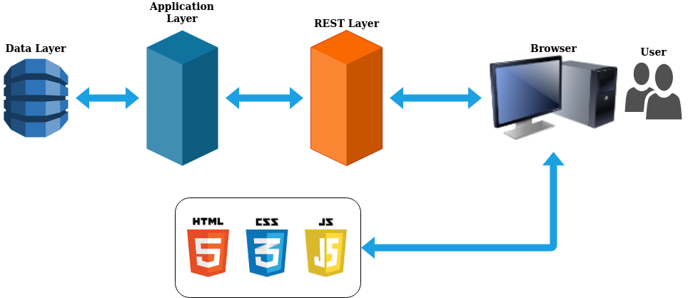
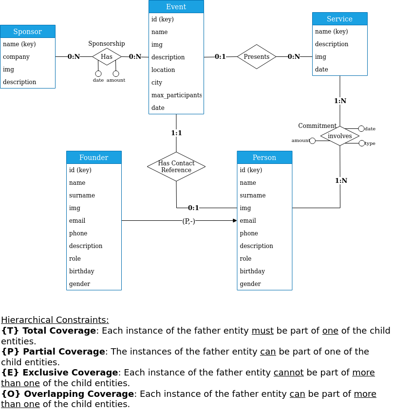
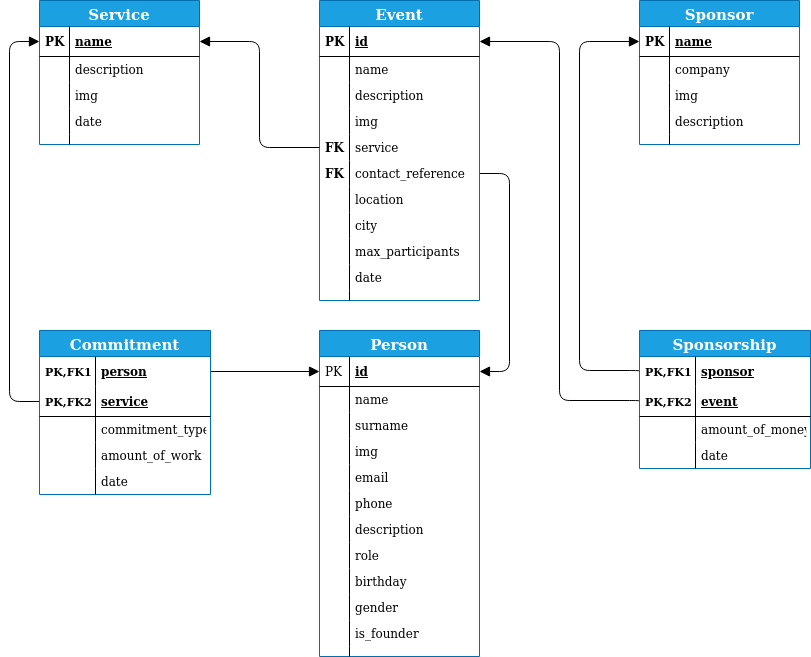

# Documentation of the Backend part
> Deliverable D1
## General group information
| Member n. | Role          | First name   | Last Name | Matricola | Email address                      |
| --------- | ------------- | ------------ | --------- | --------- | ---------------------------------- |
| 1         | administrator | Eduard Ionut | Chirica   | 878605    | eduardionut.chirica@mail.polimi.it |
| 2         | member        | Davide       | Caldana   | 953730    | davide.caldana@mail.polimi.it      |
| 3         | member        | Yan          | Dong      | 925891    | yan.dong@mail.polimi.it            |
## Links to other deliverables
- Deliverable D0: the web application is accessible at [this address](https://ramen-website.herokuapp.com).
- Deliverable D2: the YAML or JSON file containing the specification of the app API can be found at [this address](https://ramen-website.herokuapp.com/backend/spec.yaml).
- Deliverable D3: the SwaggerUI page of the same API is available at [this address](https://ramen-website.herokuapp.com/backend/swaggerui).
- Deliverable D4: the source code of D0 is available as a zip file at [this address](https://ramen-website.herokuapp.com/backend/app.zip).
- Deliverable D5: the address of the online source control repository is available [this address](https://github.com/thestarivore/ramen_website). We hereby declare that this is a private repository and, upon request, we will give access to the instructors.
## Specification
### Web Architecture
Describe here, with a diagram, the components of your web application
and how they interact. Highlight which parts belong to the application
layer, data layer or presentation layer. How did you ensure that HTML is
not rendered server side?

- **REST Layer**: Composed by the Controllers (the files present in the folder /controllers) and the Swagger        Middleware;    
- **Application Layer**: Composed by Services (the files present in the folder /service) and Utils (the files present in the folder /utils);    

To make sure that no rendering is done on the server side we ensured that we provide only static html pages that contain javascript snippets of code. And is it the javascript on these pages that create the "*dynamic content*" on the final page by calling all the needed elements and the APIs in the server.

### API

#### REST compliance
Describe here to what extent did you follow REST principles and what are
the reasons for which you might have decided to diverge. Note, you must
not describe the whole API here, just the design decisions.

We start by  explaining the principles behind REST and how have we follow them:

1.  *Uniform Interface*: this principle states that you must decide the API's interface for the resources inside the system which are exposed to API consumers and follow this model until the end. A resource in the  system should have only one logical URI, and that should provide a way  to fetch related or additional data. We respected this principle, in fact every type of data related to an entity can be retrieved on that entity's URI, for example *"server/v2/events/.."*;
2. *Client-Server*: on our case the client application and server application are able without any problem to evolve separately since there aren't any dependency between each other.
3. *Stateless*: we have definitely made our application stateless, since there are no states set between each request on the RESTful API Server. This could have been different if we would have implemented the user authentication since it would have contained a session management for the users. But we've decided to not implement the user authentication because it would not have made sense on this app, since there aren't any operation that only an authenticated user should perform.
4. *Layered System*: the system is layered, as the server is deployed in a place other than the one where the postgres server is. A client cannot ordinarily tell whether it is connected directly to the end server, or to an intermediary along the way;
5. *Code on demand*: we don't actually retrieve code via the API's, as we only retrieve static resources, so this principle doesn't count;

Finally, we can say that we are following all the principles without any divergences. The only thing worth saying is that we haven't implemented all the operations possible on the entities available on the database. Instead we've only implemented the ones we needed in our website. 

#### OpenAPI Resource models
Describe here synthetically, which models you have introduced for resources.

There is a model for each entity(table) that we can find in the Database, apart from the tables that were just introduced to create N to N relations such as *Commitment* and *Sponsorship*. Also some Models contain other models so that the users of these APIs can get all the information it needs just with one call. For instance if you retrieve an Event, it will also contain a Person (the contact reference) and a Service.

### Data model
Describe with an ER diagram the model used in the data layer of your web
application. How these map to the OpenAPI data model?

Each entity present in the ER schema is mapped with a data model schema in the OpenAPI a part from the *Commitment* and *Sponsorship*.  Note that we have multiple schemas in the OpenAPI definition that corresponds to the same entity in the ER schema. This was done so that we can minimize the amount of data passed on each request, and so that it's possible to retrieve just the needed information.

Here is the **ER Diagram** of the model: 

And here is the **ER Logic** mapping tables in the data model:

## Implementation
### Tools used
Describe here which tools, languages and frameworks did you use for the backend of the application.

The  JavaScript runtime environment used for the backend server is **NodeJS**. We also used  the **Swagger** middleware version 2.0 (OpenAPI). While for the client we used *JavaScript* and the *JQuery* JS Library;

As for the tools used, we can find:

- *Visual Studio Code*: IDE used to write all the code;
- *npm*: Standard NodeJS Packet manager;
- *KnexJS*: Javascript library to interact with the PostGreSQL database;
- *swagger-tools*: Javascript library for Swagger's middleware version 2.0;
- *DataGrip* (IntelliJ): To manage the remote PostGreSQL Database; 
- *phppgadmin*: To create(DDT) and manage locally the database;

### Discussion
Describe here:
- How did you make sure your web application adheres to the provided
OpenAPI specification? Which method did you use to test all APIs
endpoints against the expected response?
- Why do you think your web application adheres to common practices to
partition a REST-based web application (static assets vs.
application data)
- Describe synthetically why and how did you manage session state,
what are the state change triggering actions (e.g., POST to login
etc..).
- Which technology did you use (relational or a no-SQL database) for
managing the data model?
---

1. We think that we used correctly the **OpenAPI** specification by mapping each function of the Controller part to an endpoint. We also specified into the OpenAPI documentation every constraints such as the request parameters, type of parameter etc., so that these checks can be done in the Middleware.
   We mapped all the possible errors manually on the controller, making sure that they respect the specifications written for **Swagger**. 

   To test the APIs we've first tested them via the **SwaggerUI** interface, and also via browser and curl requests. We made sure that the status codes were consistent with the documentation.

2. This can be explained by taking as a reference the diagram at the beginning of the document, where *we can notice that the application layer is only exposed to the REST API and the Data Layer*. For all the static content, relative to the front-end part, *we used the **serve-static** middleware in order to map files in /www folder as the root of the website*. While we use JavaScript to generate the Dynamic content inside the html pages, by requesting this data via the REST APIs. 

   We used **npm** to maintain updated the various libraries used in both back-end and front-end.

3. We haven't implemented any type of authentications so it was not needed.      

4. To manage the data model we used a **relational database** because it is the standard solution for such a data model.    

## Other information
### Task assignment
Describe here how development tasks have been subdivided among members
of the group.

**Backend** (*includes both node.js implementation and OpenAPI specification*):

- Eduard Ionut  Chirica --> 90%;  
- Davide  Caldana --> 10%;  
- Yan  Dong --> 0%;

**Frontend**:

- Eduard Ionut  Chirica --> 50%;  
- Davide  Caldana --> 50%;  
- Yan  Dong --> 0%;

**Design**:

- Eduard Ionut  Chirica --> 0%;  
- Davide  Caldana --> 50%;  
- Yan  Dong --> 50%;

### Analysis of existing API
Describe here the research of (full or part of) existing APIs that are similar
in objectives and scope to the one implemented, that have possibly guided
implementation choices (these should not be necessarily OpenAPI
implementations). Toy APIs (such as the Swagger's Pet Store) or the example
shown during lectures are not a valid response.

The inspiration for defining the APIs of this project comes mostly from previous projects we have done. We have used and/or developed a lot of servers with a great amount of APIs. And this has helped us a lot for defining the endpoints and resources we needed to use. For instance the endpoints for this website were kind of similar in complexity to the endpoints designed for an App that one of our team member has developed and published:  [FilteRSS](https://play.google.com/store/apps/details?id=com.makebit.filterss)

### Learning outcome
What was the most important thing all the members have learned while developing this part of the project, what questions remained unanswered, how you will use what you've learned in your everyday life?

Although we had experience with using and designing APIs, we usually didn't designed them by using the Swagger Middleware, but it turns out to be very useful so we will definitely be using it again. 

We also acquired some usability and accessibility knowledge, that will be useful in any project that has a user interface. And lastly by working together with a designer, we have learned a couple of concepts that we can use anytime we work with graphics. 

